# はたけマップ 🥬

**地図で生産者を知って、畑に取りに行く。**

「誰が育てたか分からない野菜」を買うのはもうやめよう。
はたけマップは、地図の上に生産者の **顔** が並ぶ農産物マーケットプレイス。顔を見て、こだわりを読んで、レビューを確かめてから予約して、畑まで取りに行く。遠ければ宅急便で届く。
生産者側には専用アプリがあって、予約の確定から受け渡し・発送・お客さまの評価まで、全部スマホで回る。

<p>
  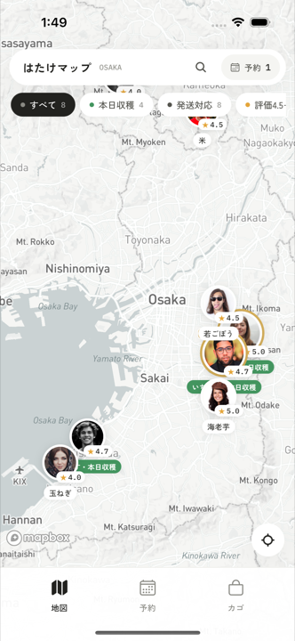
  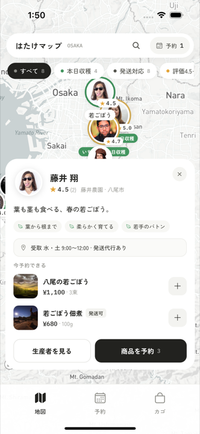
  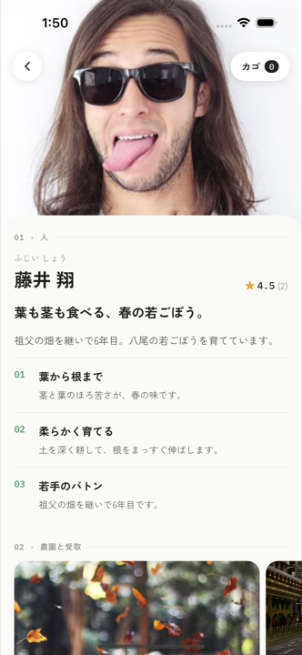
  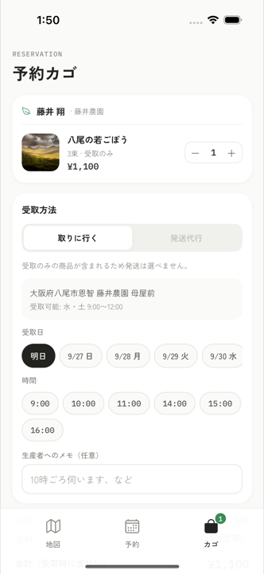
</p>

消費者アプリ・生産者アプリ・運営の承認フローまで、**1 日で全部動くところまで作った。** iOS シミュレータで消費者 → 生産者 → 運営の一連の流れを Maestro で E2E テスト済み。TestFlight で配れる状態まで持っていってある。

## ここがすごい

- **顔から始まる生産者ページ**: 「01 人 → 02 農園と受取場所 → 03 商品 → 04 レビュー」。商品より先に人を見せる。写真・ふりがな・キャッチコピー・こだわり 3 か条・SNS・畑の場所まで一画面で分かる。
- **地図がそのまま検索結果**: 承認済みの生産者だけが地図に出る。ピンには顔写真と ★ 評価。PR 生産者は大きく、一覧では先頭に。キーワード・本日収穫・発送対応・高評価・作物で一発絞り込み。
- **予約は「曜日 × 時間帯」で外さない**: 生産者ごとに受取時間帯を登録しておくと、消費者はその枠からしか日時を選べない。時間帯外・過去の日時・未承認の生産者への予約はサーバー側で弾く。
- **取りに行く／発送、どっちもいける**: 発送対応の商品はヤマト運輸の宅急便（送料 ¥880）。生産者は追跡番号を入れて「発送済み」にするだけ。
- **決済まで通る**: カード決済（テスト）で事前払い。発送は支払い後に出荷、畑での受取はその場の現地払いでも完了できる。予約の状態は リクエスト → 確定 → 受取完了 で一貫。
- **評価は双方向**: 消費者は生産者に ★ とコメント。生産者もお客さまを ★ 評価して、その評価は生産者同士だけが見られる。Airbnb 方式。
- **出荷予定をウォッチ**: まだ売っていない商品を「出荷予定」として先に載せられる。消費者がウォッチしておくと、販売開始を予約タブで知らせる。生産者にはウォッチ数が見えるので需要が先に分かる。
- **承認制で地図の質を守る**: 新規の生産者はプロフィールを登録すると「承認待ち」。運営が承認した瞬間に地図へ載る。

## 何ができるか

### 消費者アプリ

- 地図で生産者を探す → ピンをタップ → シート（ひとこと・こだわり・受取時間・今予約できる商品）→ 生産者ページ。
- 商品を予約カゴへ。受取方法は「取りに行く（受取時間帯から日時を選ぶ）」か「発送（住所入力）」。カゴの中身は画面下のフローティングバーで常に見える。
- 予約一覧・詳細。キャンセル、カード決済、追跡番号の確認。受取完了後に ★ とコメントでレビュー。
- 出荷予定の商品をウォッチ。販売が始まったら予約タブに通知。
- プロフィール（名前・電話・発送先・ひとこと）。ひとことは生産者側に見える。

### 生産者アプリ

- ホーム: 承認状態、未対応リクエスト、今日の受取、評価、PR のオン／オフと PR 文言。
- 予約管理: 確定／辞退／受取完了。発送は追跡番号を登録して発送済みに。未払いの受取は現地払いとして完了。完了後にお客さまを ★ 評価。
- 商品: 追加・編集、本日収穫、発送対応、在庫、公開／非公開、出荷予定日（ウォッチ数つき）。
- プロフィール: 顔写真、こだわり、受取場所と時間帯、SNS、畑の位置（現在地から取得可）。
- 受け取ったレビューの一覧と ★ の分布。

### 運営

- 承認待ちの生産者を承認／却下。起動画面のタイトルを長押しすると開く隠し導線。

## 画面

| 消費者 | | | |
| --- | --- | --- | --- |
| 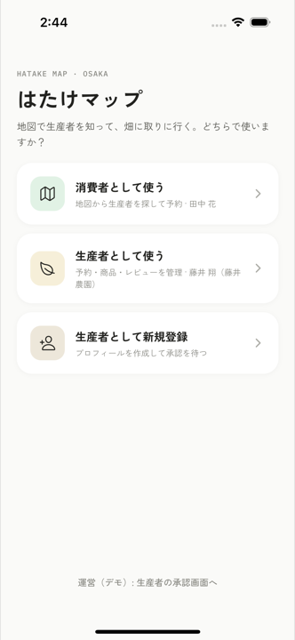 | 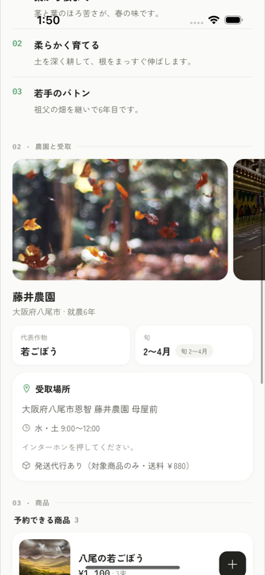 | 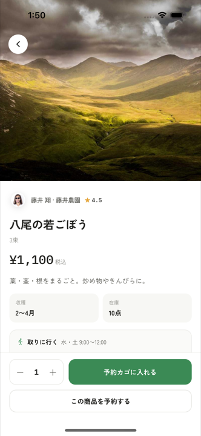 | 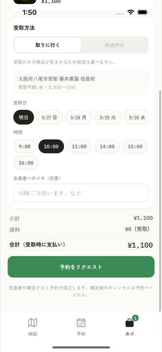 |
| ロール選択 | 農園と受取場所 | 商品 | 受取日時を選ぶ |
| 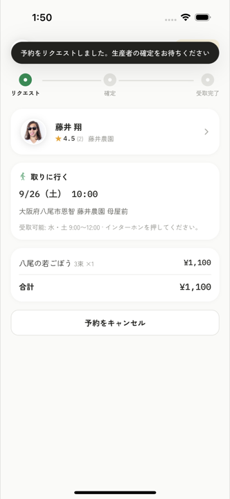 | 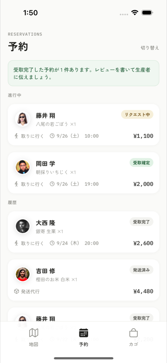 | 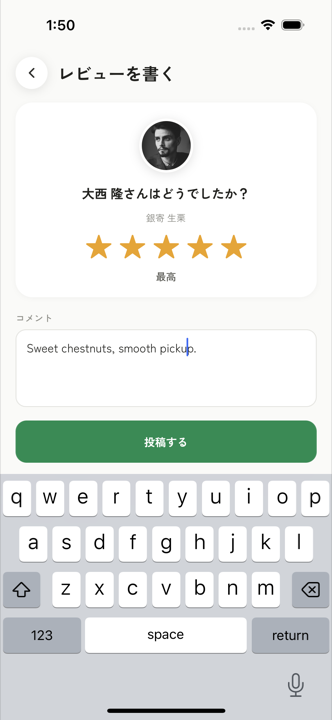 | 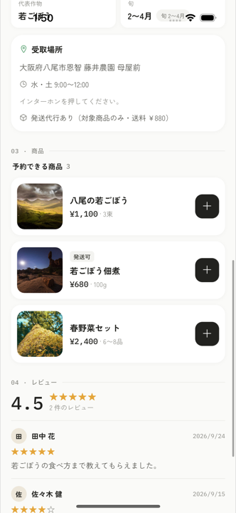 |
| 予約リクエスト | 予約一覧 | レビュー投稿 | 生産者のレビュー |

| 生産者 | | | |
| --- | --- | --- | --- |
| 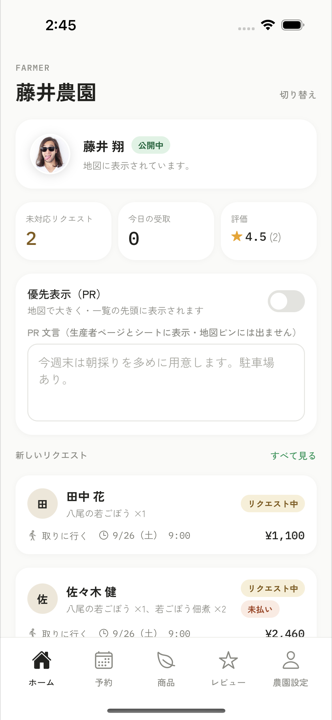 | 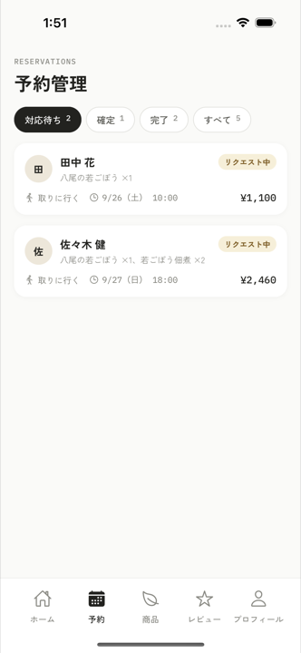 | 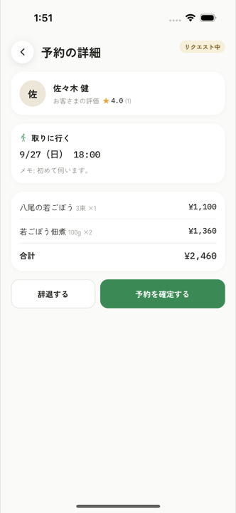 | 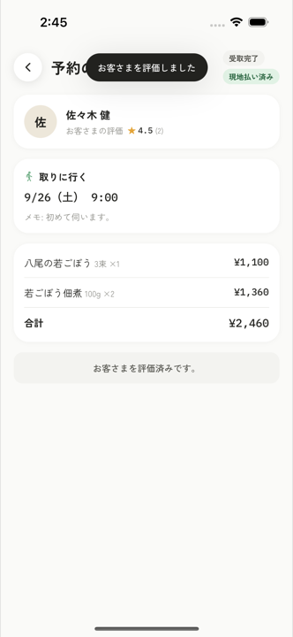 |
| ホーム | 予約管理 | リクエスト詳細 | 受取完了・お客さま評価 |
| 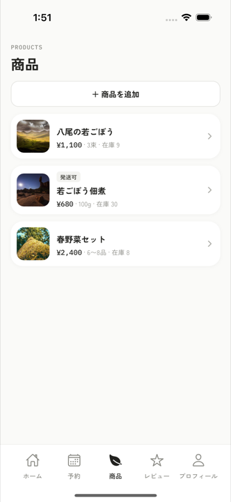 | 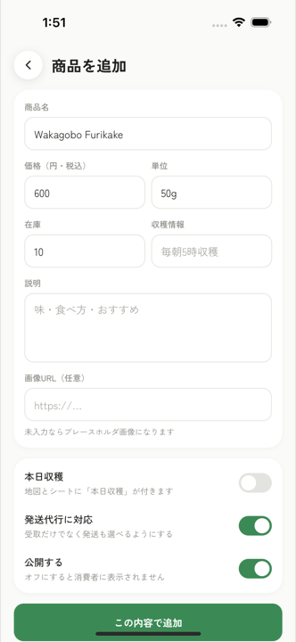 | 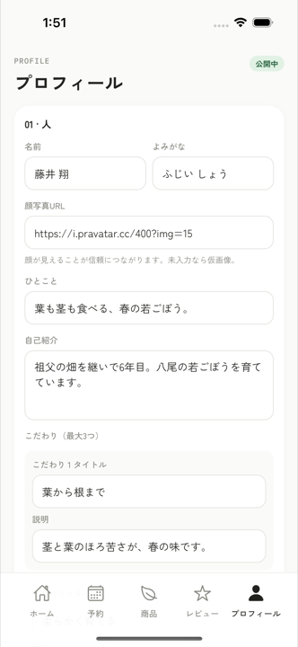 | 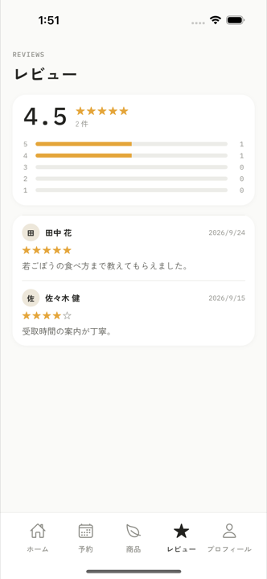 |
| 商品 | 商品の追加 | プロフィール | レビュー |

| 承認フロー | | |
| --- | --- | --- |
| 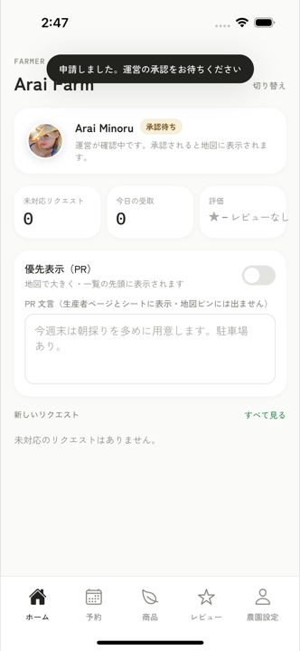 | 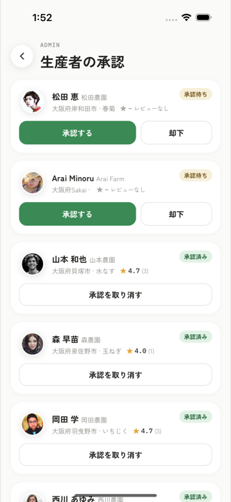 | 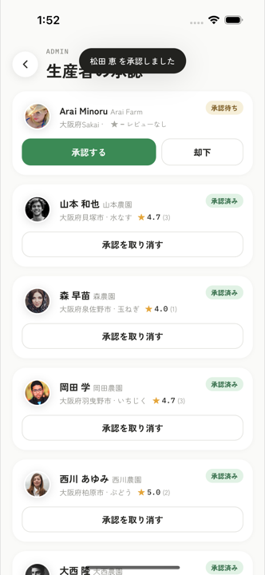 |
| 新規登録 → 承認待ち | 運営が承認 | 公開中 |

スクリーンショットは Maestro の E2E 実行中に iOS シミュレータから撮ったもの（`docs/e2e/`）。手動で並べた画像ではなく、実際に動いているフローの記録。

## 技術スタック

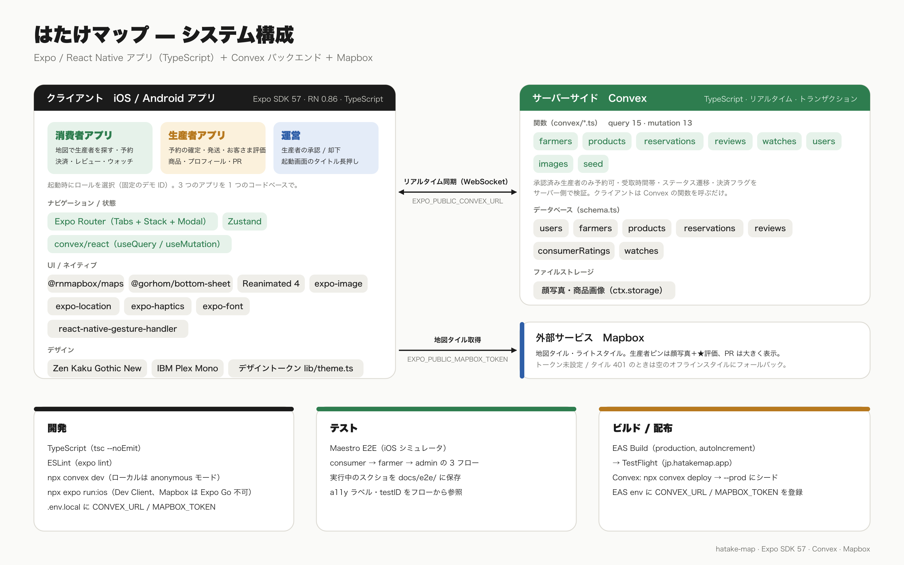

| 領域 | 使用技術 |
| --- | --- |
| アプリ | Expo SDK 57 / React Native 0.86 / TypeScript / Expo Router（Tabs + Stack、モーダル） |
| 地図 | Mapbox（`@rnmapbox/maps`）。トークン未設定でも空のスタイルでピンは動作 |
| バックエンド | Convex（スキーマ・クエリ・ミューテーション・ファイルストレージ）。リアルタイム同期なので生産者が確定した瞬間に消費者の画面が変わる |
| UI | `@gorhom/bottom-sheet`, Reanimated, expo-image, Zen Kaku Gothic New / IBM Plex Mono |
| 状態 | Zustand（ロール・カゴ・絞り込み・トースト） |
| E2E | Maestro（消費者 / 生産者 / 運営の 3 フロー） |
| 配布 | EAS Build / TestFlight |

## いちばん早い動かし方（Expo Go）

```bash
npm install --legacy-peer-deps
npx expo start --go        # ターミナルの QR を iPhone の Expo Go（App Store）で読む
```

`.env.local` の `EXPO_PUBLIC_CONVEX_URL` は本番デプロイ（`https://giant-quail-638.convex.cloud`）を向いています。同じ Wi-Fi にいる端末なら QR だけで動きます。別ネットワークなら `npx expo start --go --tunnel`。

## セットアップ

```bash
npm install --legacy-peer-deps
cp .env.example .env.local
```

1. **Convex** を起動: `npm run backend`（= `npx convex dev`）。アカウント無しなら `CONVEX_AGENT_MODE=anonymous npx convex dev` でローカル実行できる。`.env.local` に `EXPO_PUBLIC_CONVEX_URL` が書き込まれる。
2. **シード**: `npm run seed`。大阪の生産者 9 名（1 名は承認待ち）、商品、レビュー、予約のデモデータが入る。
3. **Mapbox**: `.env.local` の `EXPO_PUBLIC_MAPBOX_TOKEN` に公開トークン（`pk.…`）を設定。
4. **ネイティブビルドで起動**（Mapbox は Expo Go では動かない）: `npx expo run:ios`。2 回目以降は `npx expo start --dev-client`。

起動すると 消費者 / 生産者（藤井農園デモ） / 生産者（新規登録） を選ぶ画面になる。運営はタイトル長押し。認証は固定のデモ ID（`lib/convex.ts`）。

## 動作確認

```bash
npm run typecheck   # tsc --noEmit
npm run lint        # expo lint
npm run seed && npm run e2e   # Maestro: consumer → farmer → admin
```

iOS の Maestro は日本語入力ができないため、フロー内の入力は ASCII。

## ディレクトリ構成

```
app/
  index.tsx                 起動時のロール選択（タイトル長押しで運営）
  admin.tsx                 運営: 生産者の承認
  consumer/
    (tabs)/                 map / reservations / cart / profile
    farmer/[id].tsx         生産者ページ
    product/[id].tsx        商品
    reservation/[id].tsx    予約詳細
    pay/[id].tsx            カード決済（モーダル）
    review/[id].tsx         レビュー投稿（モーダル）
  farmer/
    (tabs)/                 home / reservations / products / reviews / profile
    reservation/[id].tsx    予約の確定・辞退・完了・発送
    product/[id].tsx        商品の追加・編集（モーダル）
components/                 FarmerMarker, FarmerBottomSheet, SearchPanel, FloatingCartBar, ProductCard, ReservationCard, ReviewCard, Stars, TabBar, ui
convex/                     schema, farmers, products, reservations, reviews, watches, users, images, seed
lib/                        theme（デザイントークン）, store（Zustand）, map, farmerView, useMyFarmer, convex（デモ ID）
e2e/                        Maestro フロー（consumer / farmer / admin）
docs/e2e/                   参照スクリーンショット
```

## データモデル（Convex）

- `users`: ロール、名前、電話、発送先、ひとこと
- `farmers`: `status`（pending / approved / rejected）, `pr` と `prMessage`, `ownerUserId`, 顔写真・こだわり・受取場所・`pickupSlots`（曜日 × 開始/終了時刻）・SNS・位置
- `products`: `harvestedToday`, `deliveryAvailable`, `stock`, `available`, `expectedAt`（出荷予定日）
- `reservations`: `status`（requested → confirmed → completed | declined | cancelled）, `method`（pickup / delivery）, `pickupAt` / `address`, `paymentStatus`（unpaid / paid）と `paymentMethod`（card / cash）, `carrier` / `trackingNumber`, 明細を埋め込み
- `reviews`: 消費者 → 生産者（公開）
- `consumerRatings`: 生産者 → 消費者（生産者間で参照）
- `watches`: 消費者が出荷予定の商品をウォッチ

## デモアカウント

| ロール | 名前 | 用途 |
| --- | --- | --- |
| 消費者 | 田中 花 | 地図から予約・レビュー |
| 生産者 | 藤井 翔（藤井農園） | 承認済み。予約・商品・レビューの管理 |
| 生産者（新規） | 新規の生産者 | プロフィール登録 → 承認待ち |
| 運営 | 運営 | 生産者の承認（タイトル長押し） |

## TestFlight 配布

事前に決めてある値: アプリ名 **はたけマップ** / Bundle ID **jp.hatakemap.app** / scheme `hatakemap`（`app.config.ts`）。

1. **Convex をクラウドへ**（ローカル匿名デプロイは実機から届きません）
   ```bash
   npx convex login
   npx convex deploy                       # 本番デプロイ。URL が表示される
   npx convex run seed:run --prod          # デモデータ投入
   ```
2. **EAS にログインしてプロジェクトを紐づけ**（設定済み: `@rinia/hatake-map`。別アカウントで配る場合は `app.config.ts` の `owner` / `extra.eas.projectId` を書き換える）
   ```bash
   npx eas-cli login
   npx eas-cli init
   ```
3. **ビルド時の環境変数**（バンドルに埋め込まれるため EAS 側に登録。`.env.local` は使われません。production 環境に登録済み、確認は `npx eas-cli env:list --environment production`）
   ```bash
   npx eas-cli env:create --environment production --scope project --visibility plaintext \
     --name EXPO_PUBLIC_CONVEX_URL --value https://<deployment>.convex.cloud
   npx eas-cli env:create --environment production --scope project --visibility sensitive \
     --name EXPO_PUBLIC_MAPBOX_TOKEN --value pk.xxx
   ```
4. **ビルドと提出**（Apple Developer Program のアカウントが必要。初回は対話で証明書・App Store Connect のアプリ作成）
   ```bash
   npx eas-cli build --platform ios --profile production
   npx eas-cli submit --platform ios --latest
   ```
   内部テスター（最大 100 名）は審査なしで即配布できます。外部テスターは Beta App Review が必要です。
5. App Store Connect の「App のプライバシー」で位置情報（アプリ機能のため・ユーザーと紐づけない）を申告。

メモ: `ITSAppUsesNonExemptEncryption: false` 設定済み（輸出コンプライアンスの質問をスキップ）。`eas.json` の production は `autoIncrement` でビルド番号を EAS 側（remote）で自動加算するため、`app.config.ts` に buildNumber は持たない。運営（承認）画面は起動画面のタイトルを 1.5 秒長押しで表示します。
